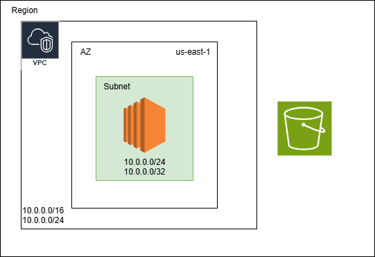
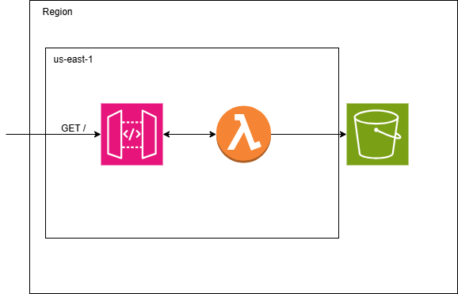

## [CloudFormation Course](https://www.udemy.com/course/aws-cloudformation-beginner-to-advanced-hands-on-guid)

## IaaC
the ability to provision and support your computing infrastructure using code instead of manual processes and settings

### Benefits
- Scale your infrastructure worldwide and manage resources using yaml or JSON files.
- Automate resource management across your organization
- Automate, test, and deploy infrastructure templates with continuous integration and delivery (CI/CD) automations.

## Concepts

### Parameters

- Optional: used to customize your template.
- Enable you to inpuy custom values to your template each time you create or update a stack
- User !Ref to reaf the options to be shown at cloudformation 

### Metadata

Provide details about the template. For example, you can include template implementation details about specific resources.

**AWS::CloudFormation::Init**
Defines configuration tasks for the cfn-init helper script. This script is useful for configuring and installing applications on EC2 instances

**AWS::CloudFormation::Interface**
Defines the grouping and ordering of input parameters when they are displayed in the CloudFormation console. By default, the CloudFormation console alphabetically sorts parameters by their logical ID.
 
**AWS::CloudFormation::Designer**
Describes how your resources are laid out in AWS CloudFormation Designer (Designer). Designer automatically adds this information when you use it to create and update templates.

## Projects

### Project 1 Archtecture

### Project 1 Archtecture
